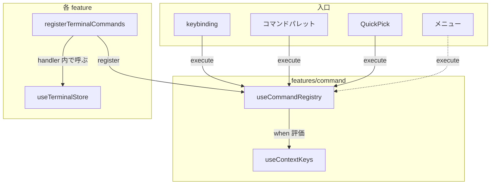

# Command

コマンドシステム。ID → handler のレジストリで、keybinding・コマンドパレット・メニュー等の複数の入口から統一的にコマンドを実行する。

## アーキテクチャ



> [!NOTE]
> 破線はまだ未実装の入口

## コマンドレジストリ

`useCommandRegistry()`（module singleton）でコマンドを登録・実行する。

```typescript
interface CommandRegistry {
  register(id: string, input: CommandInput): () => void;
  execute(id: string, args?: unknown): boolean;
  listForPalette(): readonly CommandEntry[];
  reset(): void;
  setErrorHandler(handler: (message: string, cause?: unknown) => void): void;
}
```

- `register()` は dispose 関数を返す。同一 ID の二重登録は上書き（HMR 安全）
- `execute()` は handler を `tryCatch` でラップして実行する。handler 内で例外が発生した場合は注入済みのエラー通知コールバックに渡して `false` を返す。未登録または `precondition` 不成立なら `false`
- `listForPalette()` は label が設定されており、かつ `precondition` が true（または未指定）のコマンドのみを返す。コマンドパレット UI が使用する
- `setErrorHandler()` は feature 層から通知ストアを注入するための inversion。`shared/command` から feature への直接依存を避ける
- **アプリ起動時に `setErrorHandler` で通知ストアの `error` を必ず接続する**。注入し忘れると handler の例外が標準コンソールにしか出ず、`useNotificationStore` を通したトースト通知ポリシー（CLAUDE.md 規約）と一致しなくなる
- dispose 時は一致チェックし、他の登録を壊さない

### CommandInput

`register()` の第2引数はハンドラ関数、または label 付き記述子を受け取る。

```typescript
type CommandHandler = (args?: unknown) => boolean;

interface CommandDescriptor {
  label: string; // コマンドパレットに表示する名前
  handler: CommandHandler;
  /** コマンドの有効化条件。false の場合パレットに表示されず、`execute()` もスキップされる */
  precondition?: string;
}

type CommandInput = CommandHandler | CommandDescriptor;
```

- `label` 付きで登録したコマンドのみコマンドパレットに表示される
- `label` なし（関数のみ）のコマンドはパレットに表示されない（引数付きコマンド等）
- handler は処理した場合 `true`、何もしなかった場合 `false` を返す。呼び出し元はこの戻り値で `preventDefault` 等を判断する
- `precondition` は context key 式（`parseWhen` で AST 化される）。`execute()` 経由・キーバインド経由のどちらでも条件不成立ならスキップされる。`when` と違いコマンド自体の有効/無効を示し、パレットでの可視性にも効く

### コマンド登録の例

```typescript
// label 付き: コマンドパレットに表示される
registry.register("terminal.splitHorizontal", {
  label: "Terminal: Split Horizontal",
  handler: () => {
    const active = getActiveLayout();
    if (active === undefined) return false;
    terminalStore.splitPane(active.dir, "horizontal");
    return true;
  },
});

// label なし: コマンドパレットに列挙されない（registry.execute や keybinding 経由では起動可能）
registry.register("workspace.someInternalAction", (args) => {
  if (typeof args !== "number") return false;
  // ...
  return true;
});
```

## Context Key

`useContextKeys()`（module singleton）で when 条件の評価に使う状態を管理する。キーの一覧と型は `shared/command/types.ts` の `ContextMap` が SSOT。各キーが何と同期するか（コードから読めない契約）だけをここに書く。

| キー名                  | source                                                                                                                                                  |
| ----------------------- | ------------------------------------------------------------------------------------------------------------------------------------------------------- |
| `terminalFocus`         | アクティブターミナルのフォーカス変化 + worktree 切替 / closePane / visibilitychange で同期                                                              |
| `filerFocus`            | FilerPane（ファイルツリー）内にフォーカスがあるか。フォーカス変化に追従して同期                                                                         |
| `previewVisible`        | Preview popover の開閉状態と同期                                                                                                                        |
| `previewEditable`       | 編集セッションの有無（`usePreviewEditStore.hasSession`）と同期                                                                                          |
| `childWindowFocused`    | undock された child window（別 OS ウィンドウ）がフォーカスを持つか。OS の focus / blur で同期し、`childWindow.*` コマンドの対象解決とセットで更新される |
| `commandPaletteVisible` | コマンドパレット dialog の open/close で同期                                                                                                            |
| `quickPickVisible`      | QuickPick dialog の open/close で同期                                                                                                                   |
| `filePickerVisible`     | File picker（Go to File）dialog の open/close で同期                                                                                                    |
| `prPickerVisible`       | PR ピッカー dialog の open/close で同期                                                                                                                 |
| `issuePickerVisible`    | Issue ピッカー dialog の open/close で同期                                                                                                              |
| `revivePickerVisible`   | Revive ピッカー dialog の open/close で同期                                                                                                             |
| `inputFocused`          | document の focusin/focusout を購読し、input/textarea/contenteditable へのフォーカスを検出して同期                                                      |
| `isGitRepo`             | 選択中 repo が git 管理下か。repo 選択の変化に追従して同期                                                                                              |

### When 条件

内部では typed AST（`When` 型）で表現する。外部入力（JSON 設定等）は文字列で受け取り、`parseWhen()` で AST に変換する。

```text
terminalFocus
terminalFocus && !previewVisible
terminalFocus && previewVisible || otherKey
```

- `&&` は `||` より結合が強い
- 括弧はサポートしない（VS Code 互換）
