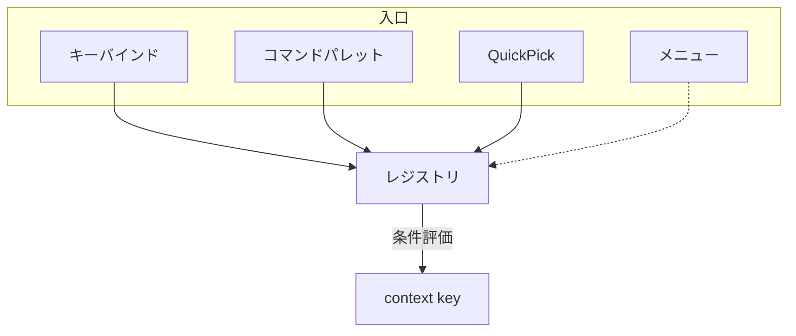

# Command

ID → handler のレジストリ。キーバインド・コマンドパレット・メニューなど複数の入口から統一的に
コマンドを実行する。


```mermaid
flowchart TB
    subgraph entry [入口]
        KB[キーバインド]
        CP[コマンドパレット]
        QP[QuickPick]
        MENU[メニュー]
    end

    KB --> CR[レジストリ]
    CP --> CR
    QP --> CR
    MENU -.-> CR
    CR -->|条件評価| CK[context key]
```

> [!NOTE]
> 破線は未接続の入口。

## レジストリの契約

| 操作             | 契約                                                                      |
| ---------------- | ------------------------------------------------------------------------- |
| 登録             | dispose 関数を返す。**同一 ID の再登録は上書き**（HMR 安全）              |
| 実行             | handler の例外を捕捉して通知に流し、失敗を返す。未登録 / 条件不成立も失敗 |
| 打鍵からの解決   | keystroke に対して実行すべきコマンドを返す                                |
| パレット向け列挙 | ラベルがあり、かつ有効なコマンドだけを返す                                |
| エラー通知の注入 | 通知の実装を外から差し込む                                                |

- **dispose は一致チェックしてから外す**。上書き後の古い dispose が新しい登録を壊さない
- **キー表示は登録情報から直接出す**。ID で別のテーブルを引く JOIN を持たない
- **エラー通知は起動時に必ず接続する**。注入し忘れると handler の例外がコンソールにしか出ず、
  トースト通知の方針と食い違う

## 登録できる情報

| 項目           | 契約                                                                      |
| -------------- | ------------------------------------------------------------------------- |
| `label`        | **これを持つコマンドだけがパレットに出る**。省略可                        |
| `keybinding`   | 既定のキー割り当て。**同義キーは配列で複数割り当てられる**                |
| `precondition` | コマンド自体の有効 / 無効。実行経路によらず効き、パレットの可視性にも効く |
| `handler`      | 処理したら true、何もしなかったら false を返す                            |

- **フォーカスを条件に取るコマンドはラベルを持たない**。パレットを開いた時点でフォーカスが移って
  条件が偽になるため、原理的にパレットからは起動できない。**ラベルがあると「一覧に出るのに実行
  できない」嘘になる**
- **異なる意味を 1 コマンドに束ねない**。同義キーの配列はあくまで同じ意味の別打鍵
- handler の戻り値で呼び出し元が既定動作の抑止を判断する

## Context Key

条件式の評価に使う状態。**key の一覧・型・意味の SSOT は型定義**で、doc コメントに意味を併記する。

**原則として key の更新は「その状態を所有する側」が行う**。例外は 2 つ。

- **条件と操作対象がペアで動くもの**は、両方を同時に更新して「条件は真なのに対象がいない」ずれを
  構造的に防ぐ
- **入力欄にフォーカスがあるか**は所有側を持たない。イベントを受けた文書の現在のフォーカスから
  評価直前に書く

### When 条件

```text
terminalFocus
terminalFocus && !previewVisible
terminalFocus && previewVisible || otherKey
```

- `&&` は `||` より結合が強い
- **括弧はサポートしない**
- **未知の key は登録時にエラーにする**（実行時まで持ち越さない）

文字列で受け取り、登録の時点で構文木に変換する。評価は構文木に対して行う。
