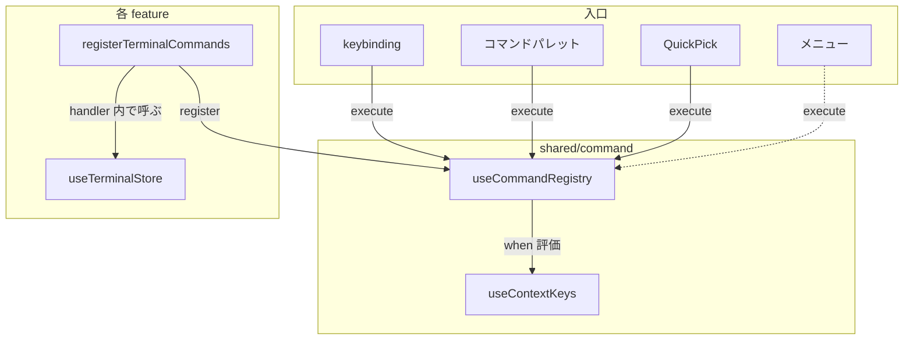

# Command

コマンドシステム。ID → handler のレジストリで、keybinding・コマンドパレット・メニュー等の複数の入口から統一的にコマンドを実行する。

## アーキテクチャ


```mermaid
flowchart TB
    subgraph entry [入口]
        KB[keybinding]
        CP[コマンドパレット]
        QP[QuickPick]
        MENU[メニュー]
    end

    subgraph command [shared/command]
        CR[useCommandRegistry]
        CK[useContextKeys]
    end

    subgraph feature [各 feature]
        RC[registerTerminalCommands]
        STORE[useTerminalStore]
    end

    KB -->|execute| CR
    CP -->|execute| CR
    QP -->|execute| CR
    MENU -.->|execute| CR
    CR -->|when 評価| CK
    RC -->|register| CR
    RC -->|handler 内で呼ぶ| STORE
```

> [!NOTE]
> 破線はまだ未実装の入口

## コマンドレジストリ

`useCommandRegistry()`（module singleton）でコマンドを登録・実行する。

```typescript
interface CommandRegistry {
  register(id: string, input: CommandInput): () => void;
  execute(id: string, args?: unknown): boolean;
  resolveKeyBinding(stroke: KeyStroke): CommandEntry | undefined;
  listForPalette(): readonly CommandEntry[];
  reset(): void;
  setErrorHandler(handler: (message: string, cause?: unknown) => void): void;
}
```

- `register()` は dispose 関数を返す。同一 ID の二重登録は上書き（HMR 安全）
- `execute()` は handler を `tryCatch` でラップして実行する。handler 内で例外が発生した場合は注入済みのエラー通知コールバックに渡して `false` を返す。未登録または `precondition` 不成立なら `false`
- `resolveKeyBinding()` は keystroke に対して実行するコマンドを返す。keybinding ディスパッチ（`useKeyBindings`）が使用する。優先度は持たず、実効条件が重なった割り当ては契約違反としてエラー通知に流す
- `listForPalette()` は label が設定されており、かつ `precondition` が true（または未指定）のコマンドのみを返す。コマンドパレット UI が使用する。キー表示は entry が持つ key 文字列から出すため、ID で別テーブルを引く JOIN は無い
- `setErrorHandler()` は feature 層から通知ストアを注入するための inversion。`shared/command` から feature への直接依存を避ける
- **アプリ起動時に `setErrorHandler` で通知ストアの `error` を必ず接続する**。注入し忘れると handler の例外が標準コンソールにしか出ず、`useNotificationStore` を通したトースト通知ポリシー（CLAUDE.md 規約）と一致しなくなる
- dispose 時は一致チェックし、他の登録を壊さない

### CommandInput

`register()` の第2引数はハンドラ関数、または記述子を受け取る（型の SSOT は `types.ts`）。

- `label` を持つコマンドだけがパレットに表示される
- `label` は任意。**フォーカスを `precondition` に取るコマンドは label を持たない** — パレットを開いた時点でフォーカスが dialog へ移り条件が偽になるため、原理的にパレットからは起動できない。label があると「一覧に出るのに実行できない」嘘になる
- 関数のみで登録したコマンドも label を持たない（引数付きコマンド等）
- 既定 keybinding は記述子でのみ宣言できる。同義キーは配列で複数割り当てられる（異なる意味を 1 コマンドに束ねない）
- handler は処理した場合 `true`、何もしなかった場合 `false` を返す。呼び出し元はこの戻り値で `preventDefault` 等を判断する
- `precondition` は context key 式（`parseWhen` で AST 化される）。`execute()` 経由・キーバインド経由のどちらでも条件不成立ならスキップされる。`when` と違いコマンド自体の有効/無効を示し、パレットでの可視性にも効く

### コマンド登録の例

```typescript
// label 付き: コマンドパレットに表示される
registry.register("terminal.splitHorizontal", {
  label: "Terminal: Split Horizontal",
  keybinding: { key: "cmd+d", when: "terminalFocus" },
  handler: () => {
    const active = getActiveLayout();
    if (active === undefined) return false;
    terminalStore.splitPane(active.dir, "horizontal");
    return true;
  },
});

// label なし: コマンドパレットに列挙されない（registry.execute 経由でのみ起動する）
registry.register("workspace.someInternalAction", (args) => {
  if (typeof args !== "number") return false;
  // ...
  return true;
});
```

## Context Key

`useContextKeys()`（module singleton）で when 条件の評価に使う状態を管理する。key の一覧・型・各 key の意味は `shared/command/types.ts` の `ContextMap` が SSOT で、doc コメントに併記する。

原則として key の更新は「その状態を所有する側」が行う。例外は 2 つ。

- `childWindowFocused` / `floatingWindowFocused` は floating-window の `childWindowCommands` / `floatingWindowCommands` が context key とコマンドの対象ハンドル（フォーカス中の window / パネル）を同時に更新し、「条件は真なのに対象がいない」ずれを構造的に防ぐ（`surfaceFocused` は MainLayout が `shared/surface` の派生値から同期する）
- `inputFocused` は所有側を持たず、ディスパッチが keydown を受けた document の `activeElement` から評価直前に書く（理由は `useKeyBindings.ts` のコメント）

### When 条件

内部では typed AST（`When` 型）で表現する。記述子の `precondition` / `keybinding.when` は文字列で受け取り、`register()` 時に `parseWhen()` で AST に変換する。

```text
terminalFocus
terminalFocus && !previewVisible
terminalFocus && previewVisible || otherKey
```

- `&&` は `||` より結合が強い
- 括弧はサポートしない（VS Code 互換）
