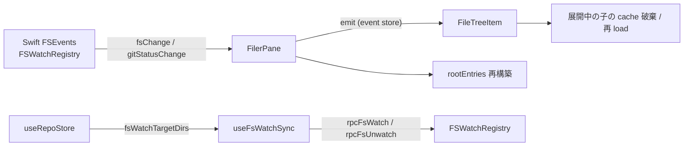

# Filer

ワークスペースのファイルツリーを表示し、git status に応じた色分けとアイコンを提供する。

## 構成

```text
features/filer/
├── FilerPane.vue          # ルートペイン（root entries の load + fsChange / gitStatusChange 購読）
├── FileTreeItem.vue       # 再帰ツリーアイテム（展開/折りたたみ、アイコン、git 色分け、reveal）
├── filerUtils.ts          # 削除エントリ生成、ソート、エントリ型
├── iconUrlMap.ts          # material-icon-theme manifest → アイコン URL マップ
├── useFileIcon.ts         # ファイル名 / 拡張子 / 言語 ID からアイコン URL を解決
├── useFilerEventStore.ts  # FilerPane → FileTreeItem の event bus（再構築通知）
├── useFsWatchSync.ts      # 全 repo / 全 worktree dir を native FSWatchRegistry に同期
├── runOneSyncPass.ts      # watchedDirs と targetDirs の差分から fsWatch / fsUnwatch を発射
├── runSerializedSync.ts   # 並列実行を mutex + coalesce で 1 本化
└── rpc.ts                 # rpcFsReadDir / rpcFsReadFile / rpcFsWatch / rpcFsUnwatch 等
```

git status の状態管理 (`useGitStatusStore`) と worktree 状態 (`useWorktreeStore`) は `features/worktree/` 配下にある。Filer はそれを購読する側。

## データフロー



ファイル監視の実体は Swift 側 `FSWatchRegistry`（FSEvents をラップ）。renderer は `useFsWatchSync` が `useRepoStore.fsWatchTargetDirs` (computed) を `watch` し、開いている全 repo / 全 worktree の dir を `rpcFsWatch` で登録する。詳細は [architecture.md](architecture.md#fswatch-の対象スコープ)。

| push event        | 発火条件                                                                                                                             | FilerPane の挙動                                                                                               |
| ----------------- | ------------------------------------------------------------------------------------------------------------------------------------ | -------------------------------------------------------------------------------------------------------------- |
| `fsChange`        | watch 対象 dir 配下のファイル変化                                                                                                    | active dir 一致時のみ反応。`relDir === ""` or `"."` で `loadRoot`、それ以外は filer event store 経由で子に通知 |
| `gitStatusChange` | per-wt の `.git/index` / HEAD、common の `refs/remotes/*` / `packed-refs`、作業ツリー側のファイル変更 (`fsChange` と同 burst で発火) | active dir 一致時のみ反応。`gitStatusStore` の再 load + root 再構築 + event store で全 FileTreeItem に通知     |
| `fsWatchReady`    | `rpcFsWatch` 成功直後の再同期シグナル                                                                                                | useSidebarData / GitGraphPane 側で消費（FilerPane は購読しない）                                               |

> [!NOTE]
> `gitStatusChange` の native 側 debounce は `FSWatchRegistry` 内部で行う。`.git/` 配下の `fs.watchFile` (Node.js API) ベースの 500ms ポーリングは持たない（過去設計）。

## 多軸 race 防止

複数の async 操作が並列で `rootEntries` を上書きしないよう、世代カウンタで防御している:

- `loadRootSeq` — `loadRoot()` の世代。`dir` が A → B → A と変わったとき同じ dir 値で旧呼び出しと新呼び出しを区別する
- `gitStatusChangeSeq` — `handleGitStatusChange` 専用世代。同一 dir 内で push が連続発火しても古い `rpcFsReadDir` 応答で新しい応答を踏み潰さない

`handleGitStatusChange` の継続判定は `(gitStatusChangeSeq + loadRootSeq + dir.value)` の 3 軸チェックで「自分が投げた呼び出しの後により新しいものが来ていない」ことを構造的に保証する。

`useFsWatchSync` 側は `runSerializedSync` で並列実行を 1 本に集約する。`watch` の依存変更で再 run が連続して起きても、`watchedDirs` 更新の race で削除済み worktree の watch が leak しない。

## ツリー自動展開（reveal）

ファイル選択時に、対象パスまでツリーを自動展開してスクロールインビューする。

- `useFilerEventStore.requestReveal(path)` が reveal target を伝搬
- `FileTreeItem` は自身の path が target の祖先か判定し、自動展開 + 子の load
- 最終ノードに到達したら `scrollIntoView({ block: "nearest" })`
- `worktreeStore.revealVersion` を bump することで「同じファイルを再度 reveal」も検知できる

dir watch は `flush: "sync"` で発火する。これは `setOpen({ selection })` で dir 変化と `revealVersion` ++ が同 tick で起きたとき、dir 変化が先に dispatch され、`rootEntries` の reset → `loadRoot` 起動 → 子マウント後の revealVersion watch (immediate) が target を処理する順序を flush ステージで構造的に保証するため。

## git status の色分け

`git status --porcelain=v2` のステータスコード（XY の2文字）から変更種別を判定する。worktree 側（Y）を優先し、なければ index 側（X）を使う。実装は `resolveGitChangeKind`（`features/worktree/`）。

| 種別      | 色     | 対象コード |
| --------- | ------ | ---------- |
| modified  | yellow | `M`        |
| added     | green  | `A`        |
| deleted   | red    | `D`        |
| untracked | green  | `??`       |
| renamed   | blue   | `R`, `C`   |

ディレクトリの色は配下の変更種別から推論する。全て同一種別ならその色、混在なら modified（yellow）。

## 削除ファイルの表示

`git status` で `D` ステータスのファイルは、ディスク上に存在しないがツリーに仮想エントリとして表示する。`getDeletedEntries()` (`filerUtils.ts`) がディレクトリ直下の削除ファイル / サブディレクトリを生成し、既存名と重複しないものだけを `mergeWithGitStatus` で追加する。

判定は `statusCode[0] === "D" || statusCode[1] === "D"` で index 側 / worktree 側のどちらの削除も拾う。

## ファイルアイコン

`material-icon-theme` の `generateManifest()` が出力する `iconDefinitions` と、Vite の `import.meta.glob` でハッシュ付きパスに変換した SVG を `iconUrlMap.buildIconUrlByName` で結合する。

解決優先順位（`useFileIcon.ts`）:

- ファイル名完全一致（`Dockerfile`, `.gitignore` 等）
- 拡張子一致（複合拡張子対応: `.test.ts` → `test.ts` → `ts` の順でループ）
- 拡張子 → VS Code 言語 ID → アイコン名（`EXTENSION_LANGUAGE_ID_MAP` で変換）
- デフォルトアイコン

SVG は `import.meta.glob` で一括取り込みし、Vite がビルド時にハッシュ付きパスに変換する。`assetsInlineLimit: 0` で SVG のインライン化を防止している。

## 関連 store（features/worktree/）

Filer から参照する store は `features/worktree/` に置く。

- `useWorktreeStore` — 選択中 worktree の `dir` / `selectedPath` / `fileServerBaseUrl` / `revealVersion` を保持
- `useGitStatusStore` — `gitStatuses` と `loadGitStatus()` を提供。`gitStatusChange` push のたびに FilerPane から呼ばれる

worktree 切替で `selectedPath` は即リセット (`watch(dir, ..., { flush: "sync" })`)、`gitStatuses` も新しい dir で再 load される。
