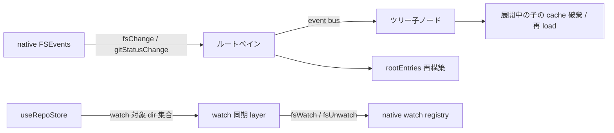

# Filer

ワークスペースのファイルツリーを表示し、git status に応じた色分けとアイコンを提供する。

## 構成

| 役割             | 担当                                                                                         |
| ---------------- | -------------------------------------------------------------------------------------------- |
| ルートペイン     | ルートエントリの load と push イベントの購読、子ツリーへの通知集約                           |
| ツリー UI        | 再帰的なノード表示、フォルダ展開・折りたたみ、git 色分けバッジ、アイコン、自動展開（reveal） |
| ファイル監視同期 | 開いている全 repo / 全 worktree の dir を native の watch registry に同期して登録 / 解除     |
| アイコン解決     | ファイル名 / 拡張子 / 言語 ID からアイコン URL を解決                                        |
| イベントバス     | ルートペインからツリー子ノードへの再構築・reveal 通知                                        |

git status の状態（`useGitStatusStore`）と worktree 状態（`useWorktreeStore`）は `features/worktree/` で管理し、Filer はそれを購読する側。

## データフロー

ファイル監視の実体は main 側の watch registry（`apps/electron/src/fs/fsWatchRegistry.ts`、@parcel/watcher）。renderer は repo store の派生 computed として「開いている全 repo / 全 worktree の dir 集合」を計算し、watch 同期 layer がその集合を観測して差分を `rpcFsWatch` / `rpcFsUnwatch` で発射する。詳細は [architecture.md](architecture.md#fswatch-の対象スコープ)。

| push event        | 発火条件                                                                                                                                                                 | ルートペインの挙動                                                                                                |
| ----------------- | ------------------------------------------------------------------------------------------------------------------------------------------------------------------------ | ----------------------------------------------------------------------------------------------------------------- |
| `fsChange`        | watch 対象 dir 配下のファイル変化                                                                                                                                        | active dir 一致時のみ反応。ルート配下の変更はルート再 load、サブディレクトリ配下の変更は event bus 経由で子に通知 |
| `gitStatusChange` | per-wt の `.git/index` / HEAD、common の `refs/remotes/*` / `packed-refs`、作業ツリー側のファイル変更（working-tree 由来は trailing-debounce 経由で遅延発火。下記 NOTE） | active dir 一致時のみ反応。`gitStatusStore` の再 load + ルート再構築 + event bus で全ツリー子ノードに通知         |
| `fsWatchReady`    | watch 登録成功直後の再同期シグナル                                                                                                                                       | サイドバー / GitGraphPane 側で消費（ルートペインは購読しない）                                                    |

> [!NOTE]
> `gitStatusChange` の native 側 debounce は watch registry 内部で行う。`.git/` 配下を Node.js API の `fs.watchFile` で 500ms ポーリングする旧設計は持たない。
>
> working-tree 由来の `gitStatusChange`（`git status` 全体 snapshot）は dir ごとの trailing-debounce タスクに集約し、`git switch` 等の checkout flood で出る複数 FSEvents バッチを最新 1 回の `git status` に畳む。ref 系（branch / HEAD / worktree 検知）は debounce を通さず即時 dispatch するため、branch label の反映は working tree の書き換え量に従属しない（[architecture.md](architecture.md#ssot-push-の-dir-filter-規律) / `FSWatchRegistry` 冒頭コメント参照）。

## 並走 race の防御

複数の async 操作が並列で `rootEntries` を上書きしないよう、世代カウンタで防御する設計を採用している。

- ルート load 専用世代: `dir` が A → B → A と切り替わったときに、同じ dir 値で旧呼び出しと新呼び出しを区別する
- gitStatusChange ハンドラ専用世代: 同一 dir 内で push が連続発火した場合、古い `rpcFsReadDir` 応答で新しい応答を踏み潰さない

gitStatusChange ハンドラの継続判定は「専用世代 + ルート load 世代 + 現在の dir 値」の 3 軸で「自分が投げた呼び出しの後により新しいものが来ていない」ことを構造的に保証する。

watch 同期 layer 側は mutex + coalesce で並列実行を 1 本に集約し、watch 対象集合の更新 race で削除済み worktree の watch が leak しないようにしている。

## ツリー自動展開（reveal）

ファイル選択時に、対象パスまでツリーを自動展開してスクロールインビューする。

- イベントバスが reveal target を伝搬し、各ツリー子ノードは自身の path が target の祖先か判定して自動展開 + 子の load を行う
- 最終ノードに到達したら `scrollIntoView({ block: "nearest" })` で表示
- 同じファイルを再度 reveal するケースを取り扱うため、`worktreeStore.revealVersion` を bump することで「再 reveal イベント」を発火させる

dir 切替と revealVersion 更新が同 tick で起きた場合の順序保証（dir 変化 → ルート初期化 → 子マウント後の reveal 処理）は、ルートペインの dir watch を同期 flush に固定することで構造的に成立させている。

## git status の色分け

`git status --porcelain=v2` のステータスコード（XY の 2 文字）から変更種別を判定する。worktree 側（Y）を優先し、なければ index 側（X）を使う。

| 種別      | 色     | 対象コード |
| --------- | ------ | ---------- |
| modified  | yellow | `M`        |
| added     | green  | `A`        |
| deleted   | red    | `D`        |
| untracked | green  | `??`       |
| renamed   | blue   | `R`, `C`   |

ディレクトリの色は配下の変更種別から推論する。全て同一種別ならその色、混在なら modified（yellow）。

## 除外エントリ

`.git` という名前の entry はファイル / ディレクトリ問わず、完全一致でツリーから常に隠す。

- 通常 repo の `.git` directory と、worktree / submodule の `.git` gitlink ファイルが同じ判定で消える
- 完全一致のため `.gitignore` / `.gitkeep` / `.gitattributes` などの近傍名は影響を受けず表示される
- `.gitignore` 経路とは独立。`.gitignore` 対象 entry は `isIgnored=true` を立てて表示したまま色を落とす（除外しない）
- working tree モード (`fs` 経路) / snapshot モード (`git ls-tree` 経路) のいずれでも `.git` は出ない。後者は git の commit tree object に `.git` が含まれない性質により自然に揃う

## 削除ファイルの表示

`git status` で `D` ステータスのファイル（index 側 / worktree 側のいずれの削除も含む）は、ディスク上に存在しないがツリーに仮想エントリとして表示する。ディレクトリ直下の削除ファイル / サブディレクトリを抽出し、ディスク上の既存エントリと重複しないものだけをツリーに追加する。

展開中のディレクトリ自体が削除された場合、`watcher` 経由で走る `rpcFsReadDir` はディレクトリ不在を `FsReadDirResponse.not_found` で返す（`FsReadFileResponse.not_found` と同じ規律で、ENOENT を 500 エラーにしない）。renderer はこれを削除ノードとして扱い、git 追跡下の削除エントリがあれば打ち消し線で表示し、untracked なら空にする。エラートーストは出さない。permission 等の真の読み取りエラーのみ throw して 500 → トースト経路に乗せる。

> [!NOTE]
> 削除によって preview 表示中のファイルが消えた場合の自動クローズは filer ではなく preview 側の責務。preview の content 取得層 (`usePreviewContent`) が再 fetch で current / HEAD いずれにも無いと判定したときに閉じる（[preview.md](preview.md#開閉機能) 参照）。filer はツリー表示の更新のみを担う。

## ファイルコピー（OS クリップボード）

ツリーで選択中のファイルを cmd+c または右クリック menu の Copy file で、
OS クリップボードに「ファイル参照」として書く。テキストの path copy（Copy path）とは
別物で、Finder / Slack 等の他アプリへファイルそのものを paste できる。

- macOS pasteboard のファイル参照形式は renderer の `navigator.clipboard` では書けないため、
  main 側 RPC（`/clipboard/copyFiles`）で書く。形式の詳細は `apps/electron/src/clipboardOps.ts`
- クリップボードに載るのはパス（参照）であり内容ではない。paste 時点の最新内容が渡る遅延評価
- snapshot mode ではコピーを拒否する。snapshot のファイルはディスクに実体が無く、パスを載せると
  「見ていた過去の内容」ではなく最新 worktree の内容が paste される誤読を生むため。無音の不発は
  「コピーしたつもり」+ クリップボード旧内容の paste 事故につながるので、キーボード経路は
  warning toast で拒否を明示し、context menu は Copy file 項目自体を出さない（可視 UI は
  出さないことが説明になる）。同じ理由で Open in default app 項目も snapshot mode では出さない
- 右クリック menu の項目 (Open in default app / Copy file / Copy path) は preview ヘッダの
  ⋮ メニューと共通の `FileActionMenuItems` を描画する（[preview.md](preview.md#ファイル操作メニュー) 参照）
- 成功時も必ず toast（Copied）を出す。クリップボードは視覚的状態を持たないため、ユーザーの
  認識（コピーした）と実状態を一致させるフィードバックが要る

## snapshot mode（git-graph 連動）

git-graph で UNCOMMITTED_HASH 以外の commit が選択されている間、filer は「そのコミット時点の全 tree」を表示する snapshot mode に切り替わる。git-graph の選択を解除（UNCOMMITTED_HASH に戻る）すれば working tree モードに戻る。

- 「今 snapshot を見ている」ことと「working tree へ戻る」手段を、GitGraphPane 側を操作せず filer 側単独で完結させるため、NavigatorPane の Filer ヘッダーに状態表示と "Now" ボタンを持つ。実装詳細（表示分岐条件・データソース）は `NavigatorPane.vue` の `<doc>` ブロックを参照
- データソースは `rpcGitLsTree(dir, hash, path)`。main 側（`gitTree.ts`）は `git ls-tree -z <hash> <path>/` で 1 階層分を返す。末尾 `/` は main 側で必ず付与する規約（外すとエントリ 1 件に倒れて lazy expand が成立しない）
- `FileEntry.kind` は `"file" | "directory" | "symlink" | "submodule"`。`git mode` (`040000` / `120000` / `160000` / その他) を SSOT 写像する
- ルート FileTreeItem は `:key="dir"` のままで mode 切替では再マウントしない。子の `snapshotHash` watch が children を invalidate して再 load することで、展開状態 (`expanded`) と孫ノードの instance を保ったまま data だけ差し替える
- mode 切替直後の `rpcGitLsTree` 完了前は children を先行 reset せず旧 mode の tree を表示し続ける設計。切替のたびに Loading フラッシュを見せると「今どこを見ているか」の continuity が壊れるため、データだけ後追いで差し替える経路に倒している (race は `loadSeq` でガード済み)。空フォルダ等で空 tree から空 tree への切替は視覚的に変化が出ないが、children 内のファイル / ディレクトリの kind や有無が変われば即座に反映される
- `FileTreeItem` の子 `v-for :key` は `${child.name}-${child.kind}` で識別する。同名 path で kind が変わる稀なケース (file→directory への mv が commit に含まれて snapshot tree で別 kind になった等) では別 instance として再マウントされ、深いツリー展開状態は失われる。これは「kind 変化 = file ↔ directory の意味変化 = 展開可能性の変化」と捉えての意図的な分離
- `fsChange` / `gitStatusChange` の watch は snapshot mode 中 no-op。snapshot は git object DB 上の固定 tree のため fs / status 変化と無関係
- git status の色分けと削除ファイル仮想エントリは行わない（過去 commit に対し working tree の status を重ねるのは誤情報）
- snapshot mode 中にファイルをクリックすると `selectedRelPath` が更新され、preview は既存 CommitMode 経路（`gitShowCommitFile`）で from/to を取得する（[preview.md](preview.md) のコミットモード）。filer 側に独自の snapshot ファイル取得経路は持たない

### click 経路の kind 別契約

- `directory`: 展開 / 折りたたみ
- `file`: `select` emit
- `symlink`: working tree モードでは `select` emit (実 file へ resolve される)。snapshot mode では
  blob 内容が target path 文字列でしかないため click を no-op に倒す
- `submodule`: 常に no-op。gitlink object (`160000`) は `gitShowCommitFile` で内容を取得できず
  preview に流すとエラーになるため。UI 上は `cursor-not-allowed` + opacity 低下 + tooltip で
  「click できない」ことを示す

### selection の境界挙動

- working mode で選択中のファイルが snapshot mode 切替後の tree に存在しない場合、Filer のハイライトは消え、Preview は CommitMode の `not_found` 規約に従って "File not found" を pane 内表示する (既存契約 / preview.md "両方 not found" を参照)。selection 自体は保持され、別 commit に切り替えればその commit に存在する path として再評価される
- worktree 切替時に FilerPane が `gitGraphStore.resetSelection()` を発火する fallback を持つ。
  GitGraphPane が unmount される経路 (MainLayout の v-if で non-git project では mount されない)
  でも singleton store の selectedHash が前 repo の値を持ち越さない

### ChangesPane との併存

- snapshot mode 中も ChangesPane は working/uncommitted モードのまま動き続ける。Filer (snapshot tree) と
  Changes (working tree 差分) は意味の異なるデータソースを同居させているが、ユーザー操作の SSOT は
  どちらも navigator selection 経由で preview に流れる
- Changes でファイルを選ぶと preview は git-graph の `selectedHash` に応じて CommitMode (snapshot)
  または UncommittedMode を出す。Filer / Changes のどちらの経路でも、対応する preview は同じ
  ルールで切り替わる

### scope 外（今フェーズ）

- 範囲選択（`compareHash`）の扱い。`selectedHash` 単独で snapshot を表示する。範囲選択時は selectedHash 側（newer endpoint）の tree が表示される
- snapshot mode 中のディレクトリのアイコン色やバッジ表示。working tree とは別の意味になるため将来検討
- submodule（`160000`）配下への 1 階層降下。本 RPC では別 repo の commit を解決しないため葉として扱う

## ファイルアイコン

`material-icon-theme` の manifest と、Vite が解決した SVG アセットを結合して「アイコン名 → URL」マップを構築する。

解決優先順位:

- ファイル名完全一致（`Dockerfile`, `.gitignore` 等）
- 拡張子一致（複合拡張子対応: `.test.ts` → `test.ts` → `ts` の順でループ）
- 拡張子 → VS Code 言語 ID → アイコン名（変換テーブル経由）
- デフォルトアイコン

SVG は `import.meta.glob` で一括取り込みし、Vite がビルド時にハッシュ付きパスに変換する。`assetsInlineLimit: 0` で SVG のインライン化を防止している。

## 関連 store（features/worktree/）

Filer から参照する store は `features/worktree/` に置く。

- `useWorktreeStore` — 選択中 worktree の dir / 選択中ファイルパス / file server base URL / reveal version
- `useGitStatusStore` — git status マップと再 load API。`gitStatusChange` push のたびにルートペインから呼ばれる

worktree 切替時は選択中ファイルパスを即リセット、`gitStatuses` も新しい dir で再 load される。
