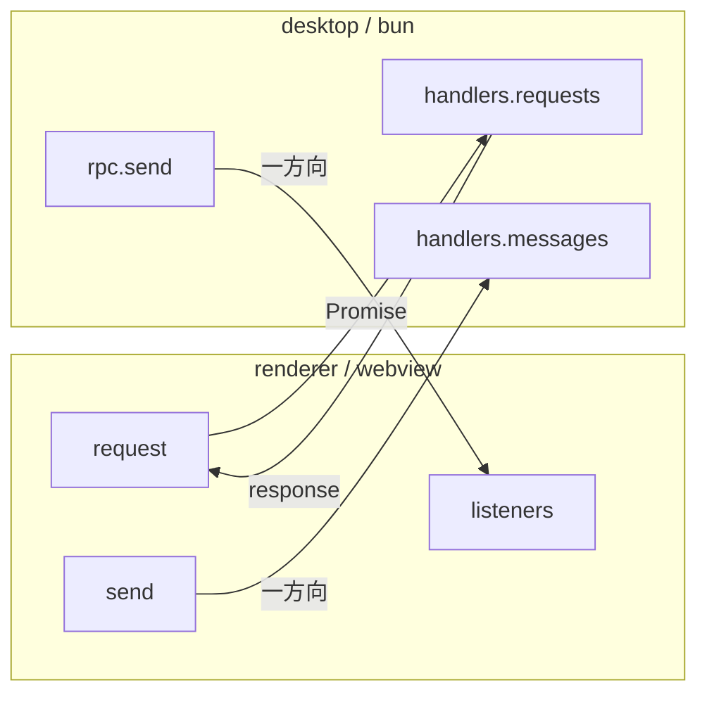

# RPC

backend ↔ webview（renderer）間通信。スキーマは `packages/rpc/src/index.ts` で定義する。

backend の実装は2つある:

| 実装                  | ファイル                                     | ランタイム | 通信方式                       |
| --------------------- | -------------------------------------------- | ---------- | ------------------------------ |
| desktop（Electrobun） | `apps/desktop/src/index.ts`                  | Bun        | Electrobun RPC                 |
| native（SwiftUI）     | `apps/native/Sources/Gozd/ContentView.swift` | Swift      | `gozd-rpc://` カスタムスキーム |

renderer 側は `useRpc()` composable で統一。native 時は `electrobunShim.ts`（Vite alias で差し替え）が `gozd-rpc://` への fetch に変換する。

## 通信モデル



## Request（renderer → desktop、Promise ベース）

| Request                  | 用途                                               | cwd        |
| ------------------------ | -------------------------------------------------- | ---------- |
| `ptySpawn`               | PTY 起動、ID を返す                                | 引数 dir   |
| `fsReadDir`              | ディレクトリ読み込み                               | currentDir |
| `fsReadFile`             | ファイル読み込み                                   | currentDir |
| `fsReadFileAbsolute`     | 絶対パスでファイル読み取り（ワークスペース外）     | —          |
| `gitShowFile`            | HEAD 時点のファイル内容                            | currentDir |
| `gitShowCommitFile`      | コミット間のファイル内容（from/to を一括取得）     | currentDir |
| `gitDiffFile`            | unified diff                                       | currentDir |
| `gitStatus`              | git status 全体                                    | currentDir |
| `gitLog`                 | コミット履歴（HEAD 系統 + デフォルトブランチ系統） | currentDir |
| `gitCommitFiles`         | コミットの変更ファイル一覧                         | currentDir |
| `gitDiffRefs`            | コミット間の diff ref を解決                       | currentDir |
| `gitWorktreeList`        | worktree 一覧を取得                                | projectDir |
| `gitBranchList`          | ローカルブランチ一覧を取得                         | currentDir |
| `gitBranchDelete`        | ローカルブランチを削除                             | currentDir |
| `createWorktree`         | worktree を作成し表示対象を切り替え                | projectDir |
| `createWorktreeWithTask` | Task に worktree を作成して紐づけ + 切り替え       | projectDir |
| `gitWorktreeRemove`      | worktree を解除（ブランチは残る）                  | projectDir |
| `gitPrList`              | GitHub PR 一覧を取得                               | projectDir |
| `gitIssueList`           | GitHub issue 一覧を取得                            | projectDir |
| `gitViewer`              | GitHub 認証済みユーザー名を取得                    | projectDir |
| `switchDir`              | 表示対象ディレクトリを切り替え（worktree 選択）    | —          |
| `configLoad`             | グローバル設定を読み込む                           | —          |
| `configSave`             | グローバル設定を保存する                           | —          |
| `projectConfigLoad`      | プロジェクト設定を読み込む                         | projectDir |
| `projectConfigSave`      | プロジェクト設定を保存する                         | projectDir |
| `taskList`               | Task 一覧を取得                                    | projectDir |
| `taskAdd`                | Task を追加                                        | projectDir |
| `taskUpdate`             | Task の body を更新                                | projectDir |
| `taskRemove`             | Task を削除                                        | projectDir |
| `voicevoxCheckEngine`    | VOICEVOX Engine の起動状態を確認                   | —          |
| `voicevoxLaunch`         | VOICEVOX Engine を起動（未インストールなら false） | —          |
| `voicevoxSpeak`          | 音声合成し WAV を base64 で返す                    | —          |

## Message（一方向）

### desktop → renderer

| Message           | 用途                                       |
| ----------------- | ------------------------------------------ |
| `ptyData`         | PTY 出力                                   |
| `ptyExit`         | PTY 終了                                   |
| `fsChange`        | ファイル変更通知                           |
| `gitStatusChange` | git status 変化 + HEAD ハッシュ            |
| `worktreeChange`  | 非アクティブ worktree でのファイル変更通知 |
| `gozdOpen`        | ウィンドウ open                            |
| `gozdHook`        | Claude Code Hook イベント                  |
| `errorNotify`     | desktop 側のバックグラウンドエラー通知     |

### renderer → desktop

| Message         | 用途                      |
| --------------- | ------------------------- |
| `ptyWrite`      | ユーザー入力を PTY に送信 |
| `ptyResize`     | PTY リサイズ              |
| `ptyKill`       | PTY 終了                  |
| `openExternal`  | 外部 URL を開く           |
| `windowClose`   | ウィンドウを閉じる        |
| `rendererReady` | renderer 初期化完了       |

> [!NOTE]
> params / response / payload の型定義は `packages/rpc/src/index.ts` を参照。

## Renderer 側の購読パターン

`useRpc()` composable が disposer パターンでリスナー登録を提供する。

```typescript
const unsubscribe = onFsChange(({ relDir }) => { ... });
onUnmounted(unsubscribe);
```

## cwd の使い分け

backend は `projectDir`（固定）と `currentDir`（`switchDir` で変化）の 2 つの作業ディレクトリを持つ。

| cwd        | 用途                                                               | 変化タイミング                                                 |
| ---------- | ------------------------------------------------------------------ | -------------------------------------------------------------- |
| projectDir | main worktree のルート。worktree 操作、task、config、PR、issue     | ウィンドウ作成時に確定、不変                                   |
| currentDir | 現在アクティブな worktree。git status、log、diff、ファイル読み取り | `switchDir`、`createWorktree`、`createWorktreeWithTask` で変化 |

## Native（Swift）実装ガイド

### ハンドラーの配置

`ContentView.swift` の `register*Handlers` メソッドに RPC 名でグループ化して配置する。

| メソッド                      | 担当                                                                                                                                                                                           |
| ----------------------------- | ---------------------------------------------------------------------------------------------------------------------------------------------------------------------------------------------- |
| `registerPTYHandlers`         | ptySpawn, ptyWrite, ptyResize, ptyKill                                                                                                                                                         |
| `registerFsHandlers`          | fsReadDir, fsReadFile, fsReadFileAbsolute, gitShowFile, gitDiffFile, gitShowCommitFile, switchDir                                                                                              |
| `registerGitHandlers`         | gitStatus, gitLog, gitBranchList, gitBranchDelete, gitWorktreeList, createWorktree, createWorktreeWithTask, gitWorktreeRemove, gitCommitFiles, gitDiffRefs, gitPrList, gitIssueList, gitViewer |
| `registerPersistenceHandlers` | configLoad, configSave, projectConfigLoad, projectConfigSave, taskList, taskAdd, taskUpdate, taskRemove                                                                                        |
| `registerVoicevoxHandlers`    | voicevoxCheckEngine, voicevoxLaunch, voicevoxSpeak                                                                                                                                             |
| `registerRendererHandlers`    | rendererReady, openExternal, windowClose                                                                                                                                                       |

### レスポンスの構築ルール

- `Encodable` 型 + `JSONEncoder().encode()` で返す
- `JSONSerialization` + `[String: Any]` は使わない（`Optional as Any` が `NSNull` に変換されず不正な JSON になる）
- スキーマがラッパーオブジェクトを要求する場合（`{ worktree, dir, fileServerBaseUrl }` 等）、対応する `private struct *Response: Encodable` を定義する
- `void` レスポンスは `Data("null".utf8)` を返す

```swift
// ラッパーレスポンスの例
private struct CreateWorktreeResponse: Encodable {
    let worktree: WorktreeEntry
    let dir: String
    let fileServerBaseUrl: String
}

// ハンドラー内
let response = CreateWorktreeResponse(
    worktree: entry,
    dir: entry.path,
    fileServerBaseUrl: "gozd-file:/"
)
return try JSONEncoder().encode(response)
```

### パラメータ・レスポンス型の配置

`ContentView.swift` 末尾にグループ別の `MARK` で配置する。型名の命名規則:

- パラメータ型: `{RPC名}Params: Decodable`（例: `CreateWorktreeParams`）
- レスポンス型: `{RPC名}Response: Encodable`（例: `CreateWorktreeResponse`）
- 既存の `Codable` モデル（`WorktreeEntry`, `TaskItem` 等）をそのまま返せる場合はラッパー不要
