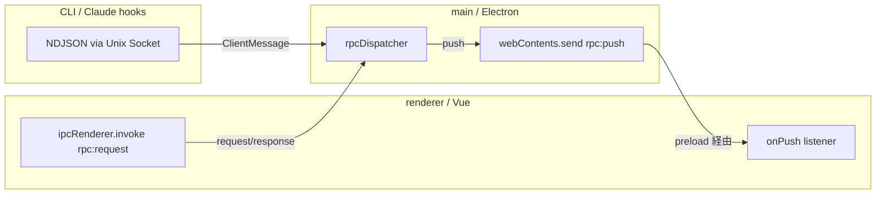

# RPC

renderer（Vue）と main（Electron）間の通信。`.proto` を SSOT に置いて型を共有する
（Swift 並走期の名残。proto 廃止 = 共有 TS 型化が次の独立ステップ）。

## SSOT は `.proto`

| パッケージ          | 役割                                                                      |
| ------------------- | ------------------------------------------------------------------------- |
| `packages/proto`    | `.proto` 定義（`gozd/v1/*.proto`）+ `buf.yaml` / `buf.gen.yaml`           |
| `packages/proto-ts` | ts-proto による生成物。`@gozd/proto` として renderer / electron が import |

生成物は git に commit せず、`packages/proto/` の `prepare` script (`buf generate`) で再生成する（詳細は [architecture.md](architecture.md) の「型共有: `.proto` SSOT」を参照）。手動再生成は `pnpm --filter @gozd/proto-schema build`。`buf.gen.yaml` では BSR のリモートプラグイン `buf.build/community/stephenh-ts-proto`（ts-proto）をバージョン pin して利用する（具体バージョンは `buf.gen.yaml` を参照）。

`.proto` ファイルはドメインごとに分割。現状の構成:

| ファイル               | 担当                                                                              |
| ---------------------- | --------------------------------------------------------------------------------- |
| `pty.proto`            | PTY spawn / write / resize / kill / data / exit                                   |
| `fs.proto`             | fs readDir / readFile / watch / unwatch                                           |
| `fs_extra.proto`       | fs writeFile / readFileAbsolute / stat                                            |
| `git_ops.proto`        | git log / diff / show / commit / worktree / pr / issue / viewer 等                |
| `git_status.proto`     | git status                                                                        |
| `task.proto`           | Task の add / update / resumableSessions (worktree の resume 可能 sessionId 一覧) |
| `app_state.proto`      | window frame / sidebar repos / selected dir 等のグローバル状態                    |
| `app_config.proto`     | ユーザー設定（terminal / preview / voicevox）                                     |
| `project_config.proto` | プロジェクト固有設定（worktreeSymlinks 等）                                       |
| `claude_session.proto` | Claude session の removeByPty / readLog (セッションログ JSONL 取得)               |
| `voicevox.proto`       | VOICEVOX engine の launch / check / listSpeakers / speak                          |
| `shell_command.proto`  | `gozd` CLI の install / uninstall                                                 |
| `window.proto`         | window close / setTitleContext                                                    |
| `open_external.proto`  | `open` コマンド経由の外部 URL / app open                                          |
| `open_target.proto`    | open dialog (pickAndOpen)                                                         |
| `echo.proto`           | デバッグ用 echo                                                                   |
| `events.proto`         | push event (FsChangeEvent / GitStatusChangeEvent 等)                              |
| `client_message.proto` | CLI / Claude hooks → native の `ClientMessage` oneof                              |
| `common.proto`         | 共有型（WorktreeEntry / Task / GhRef / GitFileChange 等）                         |

新しい RPC を足すときは該当の `.proto` に request / response / event を追加して生成物を更新し、`@gozd/proto` 経由で利用する。dispatcher 側の path 登録は `apps/electron/src/routes.ts`。

## 通信モデル

### renderer → main（request / response）

`apps/renderer/src/shared/rpc/client.ts` の `rpc()` ヘルパーが preload の `window.__gozdElectronRpc.request(path, bodyJson)` を呼ぶ（実体は `ipcRenderer.invoke("rpc:request")`）。body は proto3 JSON エンコードした request、response も proto3 JSON。生成された `toJSON` / `fromJSON` を Codec として渡す。

main 側は `ipcMain.handle("rpc:request")` が受け、`rpcDispatcher.ts` のルート表から `routes.ts` の handler に配送する。

> [!NOTE]
> binary encoding ではなく JSON を使っている。ブラウザ側で `Uint8Array` / base64 を扱うのが煩雑になるため、性能ボトルネックが顕在化するまで JSON を採用する。

### main → renderer（push）

main は `webContents.send("rpc:push", type, payload)` で renderer に push する。preload の `onPush` 経由で `apps/renderer/src/shared/rpc/messages.ts` の dispatcher が受け、type ごとのリスナーに分配する。

主な push type:

| type               | 発火元                                           | 用途                                                                                                       |
| ------------------ | ------------------------------------------------ | ---------------------------------------------------------------------------------------------------------- |
| `ptyText`          | main (`routes.ts` の node-pty onData)            | PTY 出力                                                                                                   |
| `ptyExit`          | main (`routes.ts` の node-pty onExit)            | PTY 終了                                                                                                   |
| `fsChange`         | main (`fsWatchRegistry`)                         | watch dir 配下のファイル変更                                                                               |
| `gitStatusChange`  | main (`fsWatchRegistry` の git 経路)             | git status snapshot 変化 (payload は `GitStatusChangePayload` / `GitStatusChangeEvent` を SSOT として参照) |
| `branchChange`     | main (primary worktree のみ dedup)               | ローカルブランチ参照の変化 (`refs/heads/*`)                                                                |
| `remoteRefsChange` | main (primary worktree のみ dedup)               | リモート tracking 参照の変化 (`refs/remotes/*`、push / fetch 後)                                           |
| `worktreeChange`   | main (primary worktree のみ dedup)               | `worktrees/*` 配下の変化                                                                                   |
| `fsWatchReady`     | renderer 内部 (`useFsWatchSync.dispatchMessage`) | `rpcFsWatch` 成功直後の dir 単位 re-sync シグナル                                                          |
| `gozdOpen`         | main                                             | CLI / launch request からの open リクエスト                                                                |
| `hook`             | main (`socketServer` → `HookMessage`)            | Claude Code Hook イベント                                                                                  |
| `notify`           | main                                             | main 側のバックグラウンドエラー / 情報通知                                                                 |

すべての push payload は `dir`（または発火元 dir）を必須で持つ。詳細は [architecture.md](architecture.md#ssot-push-の-dir-filter-規律) を参照。

push の payload は proto 型と 1:1 対応していない（push type 名と proto メッセージ名が異なる、または proto に存在しないフィールドを main が直接 JSON で渡すケースがある）。例:

- `gitStatusChange` の payload は `branchHead` / `upstream` ({ ahead, behind }) を nested object として渡すが、`GitStatusChangeEvent.proto` は flat な ahead/behind を持つだけ
- `remoteRefsChange` / `fsWatchReady` は proto に対応メッセージが存在しない（前者は dir のみ、後者は renderer 内部 dispatch）

実際の payload 形は、main 側 push 発火箇所と renderer 側 `*Payload` 型を SSOT とする。`events.proto` は構造の参考に留める。

### CLI / Claude hooks → main（NDJSON socket）

CLI は `gozd-cli`（TS 実装、`dist/cli.cjs`）。`Unix Domain Socket`（`$TMPDIR/gozd-{channel}.sock`）に proto3 JSON を 1 行送る。メッセージは `ClientMessage`（`packages/proto/gozd/v1/client_message.proto`）の `oneof`:

- `OpenMessage`: `gozd open <path>` / cold start launch request
- `HookMessage`: Claude Code hooks イベント

`socketServer.ts`（`node:net`）が受け、`socketMessages.ts` の逐次キューに流す。decode 失敗（不正 JSON / oneof 未指定）は stderr にログするだけで接続は維持する。

## Renderer 側の購読契約

shared/rpc がイベントバス相当の API を提供する。型付き generic + disposer パターンで購読する契約:

- `onMessage<TPayload>(type, handler)` で型付き購読、戻り値の disposer を `onUnmounted` で解除
- renderer 内部から push を発射する経路もイベントバス経由（native 経由と同じ subscriber に流れるため、source dir に紐付く再同期シグナル等で利用）
- push の到達順序は保証されない。リスナー側で必要な整合性を担保する（例: `gitStatusChange` は `dir` をキーに最新値で上書きする）
