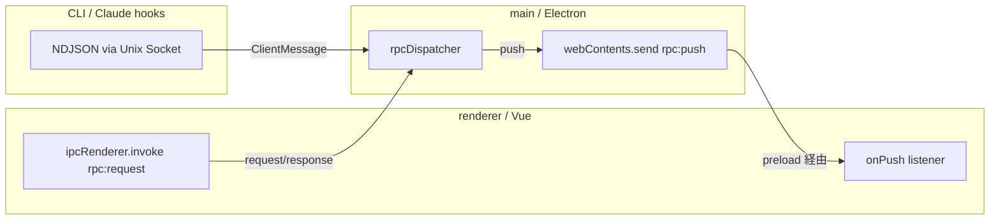

# RPC

renderer（Vue）と main（Electron）間の通信。型は共有 TS 型パッケージ `@gozd/rpc` を SSOT
に置き、ワイヤは Electron IPC の structured clone で plain data をそのまま運ぶ
（codec レス。旧 `.proto` SSOT + ts-proto 生成、および JSON 文字列ワイヤは廃止済み）。

## SSOT は `@gozd/rpc`

`packages/rpc` が全 message 型（request / response / 永続化 schema / socket の
ClientMessage）を手書き TS interface / 文字列リテラル union として持つ。renderer /
electron の両方が同じ型定義を import するため、ワイヤ変換は存在しない（オブジェクトを
そのまま渡す）。

- 型は plain data（JSON 形のオブジェクト / 配列 / プリミティブ + `WireBytes`）に限る。
  Vue の reactive proxy 等の exotic object は structured clone できず reject するため、
  呼び出し側が plain data を渡す（不変条件の SSOT は `@gozd/shared` の
  `ElectronRpcBridge` docstring）
- バイナリは `WireBytes`（専有 ArrayBuffer 背景の `Uint8Array`）を第一級で運ぶ。main の
  Buffer は送出前に exact-size コピー（`toWireBytes`）へ変換する（共有プール view を
  そのまま送ると backing buffer ごと複製され、無関係なデータが漏出するため）。socket の
  NDJSON を通る型（ClientMessage）にはバイナリを載せない
- フィールド名は旧 proto3 JSON mapping の lowerCamelCase を踏襲（永続化 JSON のキーと一致）
- `?` フィールドは undefined で未設定を表現する（永続化 JSON ではキー不在）
- 旧 enum は文字列リテラル union（`SortMode = "topo" | "date"` 等）。main 内部表現と
  同じ文字列にしてあり、境界での変換層は存在しない
- 例外は `GhRefKind`（`"GH_REF_KIND_PR"` / `"GH_REF_KIND_ISSUE"`）。tasks.json に
  永続化される値で、merge までは main branch の Swift 版 gozd と実ファイルを共有する
  ため、旧 proto3 JSON の enum 名を維持する（組み立ては `ghRefForPr` / `ghRefForIssue`
  ヘルパー経由に限定）

型ファイルはドメインごとに分割（`packages/rpc/src/`）。新しい RPC を足すときは該当
ファイルに request / response を追加して `index.ts` barrel から export し、renderer 側は
feature の `rpc.ts` に wrapper、main 側は `apps/electron/src/routes.ts` に handler を登録する。

### 両端の型付け規律

- renderer（`shared/rpc/client.ts`）: `rpc<Resp>(path, req)`。response 型は feature の
  wrapper が generic で当てる
- main（`routes.ts`）: request は `body as XxxRequest` の cast で受け（送り手が同型を
  参照する renderer なので構造は一致する契約）、response は `satisfies XxxResponse` で
  型チェックして素の object を返す
- プロセス境界を跨ぐ「信頼できない入力」（永続ファイル / socket の NDJSON）だけは
  受信側で default 充填の正規化を通す（`apps/electron/src/rawJson.ts` の契約）

## 通信モデル

### renderer → main（request / response）

`apps/renderer/src/shared/rpc/client.ts` の `rpc()` ヘルパーが preload の
`window.__gozdElectronRpc.request(path, body)` を呼ぶ（実体は
`ipcRenderer.invoke("rpc:request")`）。body / response は `@gozd/rpc` の型の plain data
そのもので、push 方向（`webContents.send`）と同じ structured clone 意味論に揃っている。

main 側は `ipcMain.handle("rpc:request")` が受け、`rpcDispatcher.ts` のルート表から
`routes.ts` の handler に配送する。

> [!NOTE]
> ファイル内容などのバイナリも本経路で `WireBytes` として運ぶ（VS Code が Electron IPC に
> `VSBuffer` の生 bytes を直接乗せるのと同じ構造）。バイナリ専用の別 scheme
> （旧 `gozd-file://` protocol）は廃止済み。

### main → renderer（push）

main は `webContents.send("rpc:push", type, payload)` で renderer に push する。preload の
`onPush` 経由で `apps/renderer/src/shared/rpc/messages.ts` の dispatcher が受け、type ごとの
リスナーに分配する。

主な push type:

| type                     | 発火元                                           | 用途                                                               |
| ------------------------ | ------------------------------------------------ | ------------------------------------------------------------------ |
| `ptyText`                | main (`routes.ts` の node-pty onData)            | PTY 出力                                                           |
| `ptyExit`                | main (`routes.ts` の node-pty onExit)            | PTY 終了                                                           |
| `fsChange`               | main (`fsWatchRegistry`)                         | watch dir 配下のファイル変更                                       |
| `fsChangeAbsolute`       | main (`absFileWatcher`)                          | watch 中の絶対パス単一ファイルの変更（preview の worktree 外追従） |
| `gitStatusChange`        | main (`fsWatchRegistry` の git 経路)             | git status snapshot 変化                                           |
| `branchChange`           | main (primary worktree のみ dedup)               | ローカルブランチ参照の変化 (`refs/heads/*`)                        |
| `remoteRefsChange`       | main (primary worktree のみ dedup)               | リモート tracking 参照の変化 (`refs/remotes/*`、push / fetch 後)   |
| `worktreeChange`         | main (primary worktree のみ dedup)               | `worktrees/*` 配下の変化                                           |
| `fsWatchReady`           | renderer 内部 (`useFsWatchSync.dispatchMessage`) | `rpcFsWatch` 成功直後の dir 単位 re-sync シグナル                  |
| `gozdOpen`               | main                                             | CLI / launch request からの open リクエスト                        |
| `serverPortsChange`      | main (`portScanner`)                             | 実行中サーバー検出結果の snapshot                                  |
| `hook`                   | main (`socketServer` → `HookMessage`)            | Claude Code Hook イベント                                          |
| `notify`                 | main                                             | main 側のバックグラウンドエラー / 情報通知                         |
| `windowFullscreenChange` | main (BrowserWindow enter/leave-full-screen)     | macOS fullscreen 遷移（タイトルバーの信号機 pad 開閉）             |
| `appConfigChange`        | main (`appConfigWatcher`)                        | AppConfig ファイル変更の hot reload（直接編集の即時適用）          |

ファイル監視系の push payload は `dir`（または発火元 dir）を必須で持つ。詳細は
[architecture.md](architecture.md#ssot-push-の-dir-filter-規律) を参照。

push payload の型は request / response と違い `@gozd/rpc` に置かない。main 側の
push 発火箇所（手組み dict）と renderer 側 feature の `*Payload` interface を SSOT とする
（`shared/rpc` は payload 形を知らない設計。`messages.ts` の設計判断を参照）。

### CLI / Claude hooks → main（NDJSON socket）

CLI は `gozd-cli`（TS 実装、`dist/cli.cjs`）。`Unix Domain Socket`
（`$TMPDIR/gozd-{channel}.sock`）に `ClientMessage`（`@gozd/rpc`）の JSON を 1 行送る。
`{"open":{...}}` / `{"hook":{...}}` のどちらか一方だけを設定する（旧 proto3 oneof の
JSON 形状をそのまま維持しており、nc 直送の固定 JSON に埋め込める）:

- `open`: `gozd open <path>` / cold start launch request
- `hook`: Claude Code hooks イベント。nc 直送経路は `event` / `ptyId` しか載せないため、
  受信側（`socketMessages.ts` の `parseClientMessage`）が default 充填して使う

`socketServer.ts`（`node:net`）が受け、`socketMessages.ts` の逐次キューに流す。decode 失敗
（不正 JSON / hook・open とも未指定）は stderr にログするだけで接続は維持する。

## Renderer 側の購読契約

shared/rpc がイベントバス相当の API を提供する。型付き generic + disposer パターンで購読する契約:

- `onMessage<TPayload>(type, handler)` で型付き購読、戻り値の disposer を `onUnmounted` で解除
- renderer 内部から push を発射する経路もイベントバス経由（main 経由と同じ subscriber に流れるため、source dir に紐付く再同期シグナル等で利用）
- push の到達順序は保証されない。リスナー側で必要な整合性を担保する（例: `gitStatusChange` は `dir` をキーに最新値で上書きする）
