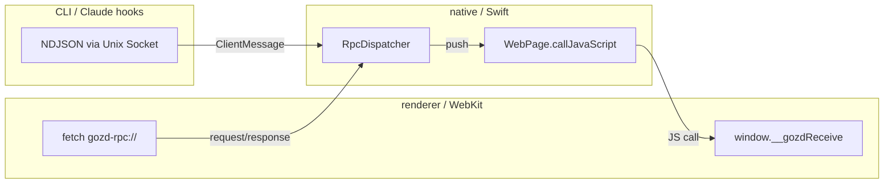

# RPC

renderer（Vue / WebKit）と native（Swift）間の通信。`.proto` を SSOT に置き、型を両言語で共有する。

## SSOT は `.proto`

| パッケージ             | 役割                                                                           |
| ---------------------- | ------------------------------------------------------------------------------ |
| `packages/proto`       | `.proto` 定義（`gozd/v1/*.proto`）+ `buf.yaml` / `buf.gen.yaml`                |
| `packages/proto-ts`    | ts-proto による生成物。`@gozd/proto` として renderer が import                 |
| `packages/proto-swift` | swift-protobuf による生成物。`GozdProto` SPM パッケージとして native が import |

生成物は git に commit する。`buf.gen.yaml` では BSR のリモートプラグイン `buf.build/community/stephenh-ts-proto`（ts-proto）と `buf.build/apple/swift`（swift-protobuf）をバージョン pin して利用する（具体バージョンは `buf.gen.yaml` を参照）。

`.proto` ファイルはドメインごとに分割: `pty.proto` / `fs.proto` / `git_ops.proto` / `git_status.proto` / `task.proto` / `app_state.proto` / `client_message.proto` / `claude_session.proto` 等。新しい RPC を足すときは該当の `.proto` に request / response / event を追加し、`buf generate` で TS / Swift の生成物を更新する。

## 通信モデル



### renderer → native（request / response）

`apps/renderer/src/shared/rpc/client.ts` の `rpc()` ヘルパーが `fetch("gozd-rpc://localhost/{path}", ...)` を投げる。body は proto3 JSON エンコードした request、response も proto3 JSON。生成された `toJSON` / `fromJSON` を Codec として渡す。

native 側は `RpcSchemeHandler`（`apps/native/Sources/Gozd/GozdApp.swift`）が URL リクエストを受けて HTTP 風レスポンスにラップして返す。実際のロジックは `RpcDispatcher`（`apps/native/Sources/GozdCore/RpcDispatcher.swift`）。

> [!NOTE]
> binary encoding ではなく JSON を使っている。ブラウザ側で `Uint8Array` / base64 を扱うのが煩雑になるため、性能ボトルネックが顕在化するまで JSON を採用する。

### native → renderer（push）

native は `WebPage.callJavaScript("window.__gozdReceive(type, payload)", ...)` で renderer に push する。renderer 側の `window.__gozdReceive` は `apps/renderer/src/shared/rpc/messages.ts` で定義され、type ごとのリスナーに分配する。

主な push type:

| type               | 用途                                                             |
| ------------------ | ---------------------------------------------------------------- |
| `ptyText`          | PTY 出力                                                         |
| `ptyExit`          | PTY 終了                                                         |
| `fsChange`         | ファイル変更通知                                                 |
| `gitStatusChange`  | git status 変化 + HEAD ハッシュ + ahead/behind                   |
| `branchChange`     | ローカルブランチ参照の変化 (`refs/heads/*`)                      |
| `remoteRefsChange` | リモート tracking 参照の変化 (`refs/remotes/*`、push / fetch 後) |
| `worktreeChange`   | 非アクティブ worktree でのファイル変更通知                       |
| `gozdOpen`         | CLI / launch request からの open リクエスト                      |
| `hook`             | Claude Code Hook イベント                                        |
| `notify`           | native 側のバックグラウンドエラー / 情報通知                     |

push の payload は proto 型と 1:1 対応していない（push type 名と proto メッセージ名が異なる、または proto に存在しないフィールドを native が直接 JSON で渡すケースがある）。実際のフィールドは送信側 (`apps/native/Sources/Gozd/GozdApp.swift` の `callJavaScript` 呼び出し箇所) と受信側 (`apps/renderer/src/features/*/rpc.ts` 等の `*Payload` 型) を直接見て確認する。`packages/proto/gozd/v1/events.proto` は構造の参考に留める。

### CLI / Claude hooks → native（NDJSON socket）

CLI は `gozd-cli` バイナリ。`Unix Domain Socket`（`$TMPDIR/gozd-{channel}.sock`）に proto3 JSON を 1 行送る。メッセージは `ClientMessage`（`packages/proto/gozd/v1/client_message.proto`）の `oneof`:

- `OpenMessage`: `gozd open <path>` / cold start launch request
- `HookMessage`: Claude Code hooks イベント

`SocketServer`（`apps/native/Sources/GozdCore/SocketServer.swift`）が NWListener で受け、`RpcDispatcher.handleSocketMessage(line)` に流す。decode 失敗（不正 JSON / oneof 未指定）は stderr にログするだけで接続は維持する。

## Renderer 側の購読パターン

`apps/renderer/src/shared/rpc/messages.ts` がイベントバス相当の API を提供する。disposer パターンでリスナー登録する。

```typescript
const unsubscribe = onFsChange(({ dir, relDir }) => {
  // ...
});
onUnmounted(unsubscribe);
```

push の到達タイミングはイベント駆動で順序保証はないため、リスナー側で必要な整合性を担保する（例: `gitStatusChange` は `dir` をキーに最新値で上書きする）。
