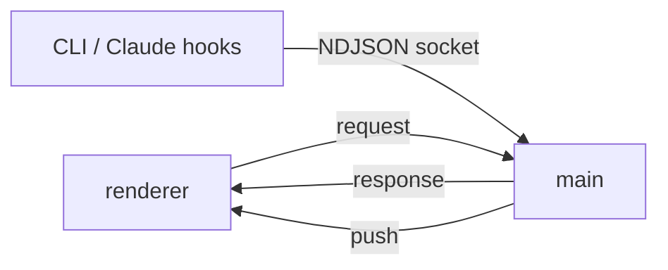

# RPC

renderer と main の通信、および CLI / Claude hooks からの受付。

## 型の SSOT

全メッセージ型（request / response / push payload / 永続化 schema / socket message）を単一の
パッケージが持ち、renderer と main の両方が同じ定義を参照する。**両端が同型を見るため、
ワイヤ変換層は存在しない**。

型に課す制約は [architecture.md](architecture.md#プロセス境界を跨ぐ型) の契約に従う。加えて:

- **列挙は文字列リテラル union** で表し、main の内部表現と同じ文字列にする。境界での変換層を
  持たない
  - 例外は `GhRef` の種別（`"GH_REF_KIND_PR"` / `"GH_REF_KIND_ISSUE"`）。永続化ファイルに書かれる
    値なので文字列を固定する。組み立ては専用ヘルパー経由に限定し、リテラルを散らさない
- **フィールド名は永続化 JSON のキーと一致させる**。永続化形式と RPC 形式で別の命名規約を
  持たない

## 通信モデル

```mermaid
flowchart LR
    R[renderer] -->|request| M[main]
    M -->|response| R
    M -->|push| R
    C[CLI / Claude hooks] -->|NDJSON socket| M
```

### request / response

renderer が path と body を渡し、main が path でハンドラへ配送して応答を返す。body と応答は
どちらも型定義そのままの plain data。

型付けの規律は非対称になる。

- **renderer**: 呼び出し側が応答型を指定する
- **main**: request は同型を参照する renderer からしか来ない契約なので受け口で型を当て、
  応答は型を満たすことを検査してから返す

ファイル内容などのバイナリも本経路で生 bytes として運ぶ。バイナリ専用の配信 scheme は
HTML preview 用の 1 つだけで、それ以外の到達経路を増やさない（[preview.md](preview.md)）。

### push

main から renderer への一方向通知。

| type                     | 意味                                                                                   |
| ------------------------ | -------------------------------------------------------------------------------------- |
| `ptyText`                | PTY 出力                                                                               |
| `ptyExit`                | PTY 終了                                                                               |
| `fsChange`               | 監視 dir 配下のファイル変更                                                            |
| `fsChangeAbsolute`       | 監視中の単一ファイル（worktree 外）の変更                                              |
| `gitStatusChange`        | git status snapshot の変化                                                             |
| `branchChange`           | ローカルブランチ参照の変化                                                             |
| `remoteRefsChange`       | リモート tracking 参照の変化                                                           |
| `worktreeChange`         | worktree の構成、または main worktree の checkout 先変化                               |
| `fsWatchReady`           | 監視登録成立後の dir 単位の再同期シグナル（renderer 内部で発射。ワイヤ push ではない） |
| `gozdOpen`               | CLI / 起動要求からの open 要求                                                         |
| `newWorktree`            | CLI が作った worktree を開けの要求                                                     |
| `serverPortsChange`      | 実行中サーバー検出結果の snapshot                                                      |
| `hook`                   | Claude Code の hook イベント                                                           |
| `notify`                 | main 側のバックグラウンドエラー / 情報通知                                             |
| `windowFullscreenChange` | fullscreen 遷移                                                                        |
| `appConfigChange`        | 設定ファイルの外部編集                                                                 |
| `debugLog`               | main 側の観測イベント（イベントログ行き）                                              |
| `textSearchMatch`        | 全文検索のマッチ逐次配信                                                               |

- ファイル監視由来の push は **発火源の `dir` を必須で持つ**
  （[architecture.md](architecture.md#ssot-push-の-dir-filter-規律)）
- 単一ファイル監視の push は exact path 一致で受け取るため、dir filter 規律の対象外
- グローバルに 1 つしか対象が無い push は filter キー自体を持たない

**ワイヤ push の type 名と payload 型の対応は単一の map が持ち、送信側はその map で型検査
される**。未登録の type 名や payload 形の取り違えはコンパイルエラーになる。renderer 内部
イベント（`fsWatchReady` / `claudeFx` 等）はワイヤ契約ではないため map に載せず、所有側が型を
持つ。イベントバスはワイヤと内部イベントの両方を運ぶため payload の形を知らず、購読側が型を
当てる。

### CLI / Claude hooks → main

ソケットの受付契約は [architecture.md](architecture.md#ソケットからの受付)。メッセージは
種別ごとのフィールドを 1 つだけ持つ形で、**フィールドを持たない直送経路でも埋められる**
最小構成に保つ。受信側が不在フィールドを default で埋める。

応答の有無は種別で決まる。状態を通知するだけの種別は送りっぱなしにし、**実行者が結果を
知らないと次へ進めない種別だけ 1 行の応答を返す**。worktree の作成がこれにあたる —
送れたことと作れたことは別で、後者を確かめずにエージェントが次の指示を出せない。

## renderer 側の購読契約

push の購読はイベントバス相当の API を通す。

- **購読は disposer を返す**。コンポーネントの破棄時に必ず解除する
- **renderer 内部からも同じバスへ push を発射できる**。main 由来と同じ購読者へ流れるため、
  再同期シグナルのような内部イベントを同じ経路に乗せられる
- **push の到達順序は保証しない**。購読側が必要な整合性を担保する（dir をキーに最新値で
  上書きする等）
- **1 つの購読者が throw しても他への配送は続く**。失敗は呼び出し元へ伝播せず、
  イベントログに記録される
- **同一 type に同じ関数を二重購読しても 1 件として扱う**。1 回の解除で消える
