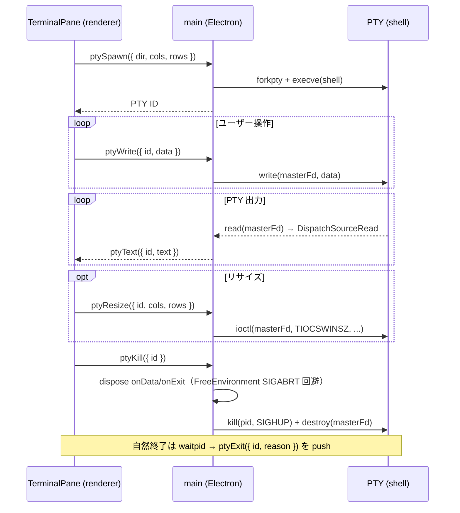

# Terminal

ターミナルエミュレータ。RPC（IPC）経由で main process 側の PTY プロセスと通信する。
xterm.js をバックエンドとして使用する。

## 構成

```text
features/terminal/
├── TerminalPane.vue              # leaf 群の統括コンテナ（CSS Grid レイアウト、可視性制御、コマンド登録）
├── TerminalLeaf.vue              # リーフノード（XtermTerminal ラップ、フォーカス管理）
├── SplitResizeHandle.vue         # 分割リサイズハンドル（ドラッグ）
├── XtermTerminal.vue             # xterm.js ターミナルエミュレータ
├── splitTree.ts                  # immutable な分割ツリー操作（split, remove, resize）
├── terminalConfig.ts             # 共通設定（フォント、スクロールバック、テーマ ref）
├── registerTerminalCommands.ts   # 分割・ナビゲーションコマンドの登録
├── registerThemeCommand.ts       # テーマ選択コマンド（QuickPick + リアルタイムプレビュー）
├── useTerminalStore.ts           # worktree ごとの分割レイアウト状態管理（Pinia）
├── useFilePathLinkProvider.ts    # ターミナル出力のファイルパス検出・クリック
├── useSplitResize.ts             # ratio ベースのリサイズ管理
└── useSpatialNavigation.ts       # leaf 間の矩形ベース空間ナビゲーション
```

## PTY ライフサイクル



- shell: `/bin/zsh`（renderer 側で固定。`apps/renderer/src/features/terminal/useTerminalStore.ts` の `DEFAULT_SHELL`）
- cwd: `ptySpawn` の `dir` パラメータ（worktree ごとに異なる）
- 環境変数: PTY spawn 時に native 側で固定の overlay が適用され、CLI ツール向けに `FORCE_HYPERLINK=1` / `TERM=xterm-256color` / `COLORTERM=truecolor` / `TERM_PROGRAM=gozd` を保証する（renderer から `env` を渡しても、上記キーは指定が無い場合のみ overlay 側で埋まる）。全項目と上書き順序は [architecture.md](architecture.md#ターミナル環境変数) を参照
- UTF-8 デコード: `TextDecoder({ stream: true })` でチャンク分割時のマルチバイト文字化けを防止

## ターミナル分割

バイナリツリー構造で水平・垂直分割を管理する。`splitTree.ts` が immutable なツリー操作を提供する。

```
splitNode（内部ノード）
├── direction: "horizontal" | "vertical"
├── ratio: 分割比率（0〜1）
├── left: SplitNode | LeafNode
└── right: SplitNode | LeafNode

leafNode
└── id: ターミナル ID
```

### CSS Grid レイアウト

`TerminalPane` が全 worktree の全 leaf を1つの CSS Grid コンテナでフラットに管理する。`treeToGridTemplate()` が分割ツリーから `grid-template-areas` / `columns` / `rows` を生成し、各 leaf は `grid-area` で配置される。表示モードの切り替えはコンテナの grid-template を変えるだけで済む。

- leaf の DOM は v-show で表示/非表示を制御（xterm バッファは維持される）
- リサイズハンドルは `flattenHandles()` で gap の位置を算出し、absolute overlay で配置

### 空間ナビゲーション

`useSpatialNavigation` が各 leaf の矩形位置（rect）から、指定方向の最近傍 leaf を算出する。非表示 worktree の leaf は候補から除外する。

### コマンド

| コマンド                   | 動作                                                                                                                                                                               |
| -------------------------- | ---------------------------------------------------------------------------------------------------------------------------------------------------------------------------------- |
| `terminal.splitHorizontal` | アクティブ leaf を水平分割                                                                                                                                                         |
| `terminal.splitVertical`   | アクティブ leaf を垂直分割                                                                                                                                                         |
| `terminal.closePane`       | アクティブ leaf を閉じる（PTY も kill）。Claude が working の leaf は確認ダイアログを挟む（PTY kill で作業が失われるため。done + pendingWork の「裏で作業継続中」も working 扱い） |
| `terminal.focusLeft`       | 左の leaf にフォーカス移動                                                                                                                                                         |
| `terminal.focusRight`      | 右の leaf にフォーカス移動                                                                                                                                                         |
| `terminal.focusUp`         | 上の leaf にフォーカス移動                                                                                                                                                         |
| `terminal.focusDown`       | 下の leaf にフォーカス移動                                                                                                                                                         |

## Worktree ごとのレイアウト保持

`useTerminalStore`（Pinia）が `layoutsByDir`（`Map<dir, TerminalLayoutState>`）で worktree ごとに分割レイアウトを保持する。

- `visit(dir)` で初回訪問時にレイアウトを作成し、PTY を spawn する。2 回目以降の `visit` は既存レイアウトをそのまま使う（PTY と xterm バッファは破棄しない）
- worktree 切り替え時は v-show で対象 leaf のみ表示する。非表示中も PTY と xterm バッファは生存する
- worktree 削除時 (`removeWorktreeFromLayout`) は `visitGenByDir` を bump して進行中の `visit` を stale 化し、`layout.remove(dir)` で該当 dir の全 PTY を kill する。さらに `preferredResumeByDir` / `preferredAutostartByDir` の未消費ヒントも掃除する（再作成された worktree に古い意図が漏れないようにする）

### TerminalPane のレイアウト

`TerminalPane.vue` が全 worktree の全 leaf を1つの CSS Grid でフラットに管理する。MainLayout はこのコンポーネントを配置するだけでよい。

- **コンテナ**: `grid-template-areas` / `columns` / `rows` で全 leaf の配置を定義。`:style` バインディングで動的に設定
- **子（TerminalLeaf）**: `grid-area` でどのエリアに入るかを宣言するだけ。サイズはコンテナ grid が決める
- **リサイズハンドル**: `flattenHandles()` で gap 位置を算出し、absolute overlay で配置

> [!NOTE]
> `v-show:false` は `display:none` になるため、非表示の leaf は grid item から外れ auto-placement に影響しない

#### 表示モード

`useTerminalStore.viewMode` で3つのモードを切り替える。

- **wt**（デフォルト）: `treeToGridTemplate()` でアクティブ worktree の分割ツリーから grid-template を生成。非アクティブ leaf は `v-show:false`
- **all**: `tileGridTemplate()` で全 leaf を均等タイル配置
- **claude**: `tileGridTemplate()` で Claude 起動中の leaf のみ均等タイル配置

`viewMode` はユーザー意図 (`userViewMode`) と表示用実効値 (`viewMode` computed) の 2 段で管理する。実効値は `userViewMode === "claude" && claudeActiveLeafIds.length === 0 ? "wt" : userViewMode`。これにより `claude` モード中に Claude セッションが全終了しても `tileGridTemplate()` の対象が空にならず、画面が真っ黒になる事象を回避する（Claude が再起動すれば `userViewMode` は `claude` のままなので自動復帰する）。`viewMode = "wt"` のような外部からの代入は computed の setter 経由で `userViewMode` に転送される。

加えて、ターミナル分割コマンド（`terminal.splitHorizontal` / `terminal.splitVertical`）は split 直前に `userViewMode = "wt"` を明示する。新規 pane は素の PTY なので claude タイル対象外であり、ユーザーが分割操作を行った時点で意図は「アクティブ worktree のレイアウトを編集」に変わったとみなす。

`all` / `claude` モードでは複数 worktree の leaf が同時に表示されるため、focus を受けた leaf は常に `worktreeStore.setOpen(dir)` を呼んで選択を追従させる。viewMode は変更しない（横断ビューを維持したまま、サイドバー・ファイラー・プレビューのみ追従）。`wt` モードでは同 dir に対する setOpen となり実質的に no-op だが、`selectionVersion` を発火させて `clearDoneStates` を起動するために常に呼ぶ（[claude-status.md](claude-status.md) の既読消化フロー参照）。

active leaf の判定は「選択中 worktree（`worktreeStore.dir`）配下」かつ「`layout.focusedLeafId` と一致」の AND で行う。`layoutsByDir` は dir ごとに独立した `focusedLeafId` を持つため、単純比較だと tile モードで worktree ごとに 1 つずつ active 表示になってしまう。worktree 単位の選択を条件に加えることで、横断ビューでも `opacity-100` で表示される leaf は最大 1 つに収まり、それ以外は `opacity-50` にフェードする。`worktreeStore.dir` 未確定時や、`claude` モードで選択中 worktree に Claude-active leaf が存在しない場合は active が 0 になりうる。

## OSC ハンドラ

xterm.js のイベントまたは `parser.registerOscHandler()` でエスケープシーケンスを受信し、store に保存する。

| OSC | 用途                | 受信方法                          | 保存先          | 用途                               |
| --- | ------------------- | --------------------------------- | --------------- | ---------------------------------- |
| 0   | タイトル+アイコン名 | `terminal.onTitleChange` イベント | `titleByLeafId` | Task タイトル同期（leaf に非表示） |
| 2   | タイトル            | `terminal.onTitleChange` イベント | `titleByLeafId` | Task タイトル同期（leaf に非表示） |

- OSC 0/2 は xterm.js に既定ハンドラがあるため `registerOscHandler` ではなく `onTitleChange` イベントを購読する
- タイトルは Claude Code 等のプログラムが `\x1b]2;タイトル\a` で設定する。Ghostty 等の一般的なターミナルと同じ標準的な仕組み
- 空文字列が送信された場合はタイトルをクリアする
- 選択中 worktree のターミナルでタイトルが更新されると、`useSidebarData` が worktree に紐づく Task のタイトル（body 一行目）を同期する。Task がなければ新規作成し、既にタイトルがある Task は上書きしない
- leaf 上部のヘッダには OSC タイトル / CWD は表示しない。Claude セッションが attach された leaf だけ、サイドバー TaskRow と同一の status アイコン + Task タイトルを `TerminalLeafTitle` で表示する（素の PTY では何も出さない）

## ファイルパスリンク

`useFilePathLinkProvider` が xterm の LinkProvider を実装し、ターミナル出力のファイルパスをクリック可能にする。

- 相対パスと任意の絶対パス（worktree 内 / 外 / `/tmp/...` / `/var/folders/...` / `~/` 展開）に対応
- パスの直後に `:行番号` が続く場合（`src/main.ts:30` 等）は行番号を抽出
- クリック時にプレビューペインでファイルを表示（行番号付きの場合は該当行にスクロール＋ハイライト）

### 相対パスの解決基準は「その行が出力された時点のシェル cwd」

ツール（tsc / eslint 等）はパスを実行時の pwd 基準で出力するため、worktree root 基準で解決すると
サブディレクトリで実行した出力のリンク先がずれる。zsh init が chpwd hook で送る OSC 7 を
`registerOscHandler(7)` で受け、`cwdTracker` が「遷移が起きたバッファ行 → cwd」の列として保持する。
相対パスは hover 行以前で最後の遷移の cwd 基準で絶対パス化し、worktree 内なら
worktreeRelative（filer reveal が成立）、外なら absolute（プレビューのみ）に解決する。

- 最新 cwd の単一値でなく行位置つき遷移列を持つのは、cd 後にスクロールバックへ残った古い出力の
  リンクが最新 cwd で誤解決するのを防ぐため。遷移位置は xterm の Marker で追跡し、
  scrollback trim / resize reflow による行移動に自動追従する（遷移列の保持戦略は
  `cwdTracker` の docstring が SSOT）
- cwd 不明（OSC 7 を送らないシェル / 最初の遷移より前の行）は worktree root 基準に fallback する
- 遷移列は Marker が terminal インスタンスに紐づくため store には置けず、component と同じ
  ライフサイクルで持つ。再マウント時は ring buffer replay が OSC 7 を再発火して再構築する。
  replay 窓から evict された遷移より前の行は worktree root 基準に倒れる
- zsh hook は `%` のみ `%25` に escape して送る。受信側は常に percent-decode するため、
  パス中の literal `%XX` の誤 decode を送信側の escape で防ぐ（非 ASCII は生 UTF-8 のまま
  decode を素通りするので full encode は不要）

### パス境界（区切り文字）

`PATH_TERMINATORS`（`findAbsolutePathMatches.ts`）でパスの末尾を判定する。シェルで unquoted なパスに現れない文字を区切りとする。

- ベースは VS Code `terminalLinkParsing` の Unix 版 `ExcludedPathCharacters`（リダイレクト `<` `>` / サブシェル `(` `)` / コマンド置換 `` ` `` / glob `*` `?` / 履歴展開 `!` / エスケープ `\` / 引用符 `'` `"` / 行番号区切り `:` `;` 等）
- gozd 独自の追加: `#`（コメント・fragment）/ `|` `$`（パイプ・変数展開）/ `{` `}` `[` `]` `,`（log 出力がパスを囲む慣習、開き／閉じ対称）
- VS Code が持つ `\0`(NUL) は xterm バッファに来ない前提で除外

gozd は VS Code と異なりパスの存在検証をしない。VS Code は最終的に `stat` で実在を確認して誤検出を弾くが、gozd にはその検証層が無いため、区切りを保守的に取る（`#` を含める等）ことで誤検出を抑える。

### 改行折り返しの結合（collectIndentedBlock）

Claude Code が改行+インデントで折り返した長いパスも結合して検出する。

- ハードラップ（`isWrapped`）は空白が挿入されないのでそのまま連結する
- 明示改行+インデントは、継続行の trim 後の先頭文字が区切り文字でない（＝パス文字始まり）時のみ連結する。`.../file.txt` の次に来る `# コメント` のような区切り文字始まりの行は別トークンとして結合しない。`.../very/lo` ⏎ `  ng/file.ts` のようなセグメント途中の折り返しは正しく繋ぐ
- 継続行が絶対パス root（`/` `~`）で始まる場合は連結しない。`/...` `~/...` は単独の絶対パスであって上の行の継続ではないため、shebang やコメントの直下に来ても上の行と繋がず、汚染で boundary が壊れてリンクが消えるのを防ぐ
- 結合テキストと「現在行の開始オフセット」を同じ下方向パスで算出し、結合条件と offset 計算の二重管理（desync）を防ぐ

## xterm.js アドオン

`XtermTerminal.vue` で以下を `loadAddon` する。

| アドオン         | 役割                                                                   |
| ---------------- | ---------------------------------------------------------------------- |
| `FitAddon`       | コンテナサイズに合わせて cols / rows をリサイズ                        |
| `Unicode11Addon` | Unicode 11 幅テーブルで CJK・絵文字の幅計算を正確にする                |
| `WebLinksAddon`  | テキスト中の URL パターンを自動検出（クリックで `open_external` 呼出） |
| `WebglAddon`     | GPU レンダラ。スクロール / 高頻度更新時のフレームレートを稼ぐ          |

加えて `useFilePathLinkProvider` で `terminal.registerLinkProvider` を呼び、ファイルパス（相対 / 絶対 / 改行折り返し）を別途検出する。

## 設定（terminalConfig.ts）

- フォント: UDEV Gothic 35NF, Menlo, monospace（13px）
- テーマ: `@gozd/themes` パッケージから iTerm2-Color-Schemes ベースのテーマを選択可能。コマンドパレットの "Terminal: Select Theme" で QuickPick が開き、dark/light セクション分けで表示される。フォーカスでリアルタイムプレビュー、Enter で確定保存、Escape でロールバック。選択テーマ名は `config.json` に永続化される
- デフォルトテーマ: zinc 系ダークテーマ（xterm 背景 `#18181b`）
- ペイン背景: `bg-background`（semantic token）。非アクティブ leaf は `opacity-50` で背景が透ける
- カーソル: 点滅有効

## スクロール位置保持（xterm.js）

TUI アプリ（Claude Code 等）が normal buffer で動作する場合、スクロールバック中に再描画が起きるとエスケープシーケンスにより viewportY がリセットされる。ネイティブターミナルではコア内部でスクロール位置を管理するためこの問題は起きないが、xterm.js ではコア内部を変更できないため外部から補正する。

### 業界ターミナルの設計

| ターミナル | アンカー方式                             | 行追加時の処理                                           |
| ---------- | ---------------------------------------- | -------------------------------------------------------- |
| alacritty  | `display_offset`（スクロールバック行数） | `scroll_up()` 内で `display_offset += positions`         |
| kitty      | `scrolled_by`（スクロールバック行数）    | render loop で `scrolled_by += history_line_added_count` |
| WezTerm    | `StableRowIndex`（論理行インデックス）   | `stable_row_index_offset` で削除行数を追跡               |

共通点:

- スクロール位置はターミナルコアの内部状態として管理される
- 外部 callback で補正するパターンはどのターミナルにも存在しない

### xterm.js での実装: ViewportIntent + Marker

xterm.js の `registerMarker()` は安定アンカーとして機能し、行の追加・削除に追従する。

```text
ViewportIntent = "bottom" | "anchored(marker)"

write() 前:
  captureViewportIntent()
    → bottom にいる or alternate buffer → intent = bottom
    → スクロールバック中 → Marker を登録して intent = anchored(marker)

write() 後（onWriteParsed で集約）:
  restoreViewportIntent()
    → intent = bottom → scrollToBottom()
    → intent = anchored → marker.line に scrollToLine()
```

`onWriteParsed` はフレームごとに最大1回発火するため、高頻度 write() でも復元が1回に集約される。

### 検討・却下した方式

- **viewportY 生値の共有変数**: xterm.js の非同期 WriteBuffer とスナップショットの対応が崩れる
- **viewportY 生値のローカル変数（クロージャキャプチャ）**: コールバック実行時に古いスナップショットでユーザー操作を踏み潰す
- **scrollRevision（世代番号）**: 業界4大ターミナルのどれにも存在しないパターン

### リサイズ時の挙動

リサイズ時は Marker ベースの復元を試みるが、TUI アプリの SIGWINCH 再描画で Marker 復元後にずれる場合がある。他のターミナル（alacritty, kitty 等）でもリサイズ時は bottom にリセットされるため、許容する。

## main 側の PTY 管理

- PTY の実体は node-pty。instance の所有は `apps/electron/src/routes.ts`、PTY ⇔ Claude session の紐付けは `ptySessions.ts` が持つ
- アプリ終了時 (`will-quit`) の `killAllPtys`・個別 kill・worktree 削除は共通の破棄経路（`teardownPty`）を通す。順序が契約: **node-pty の onData/onExit listener を kill より先に dispose する**。dispose を怠ると native の ThreadSafeFunction callback が `node::FreeEnvironment()`（env 破棄）まで生き残り、破壊済み env 上で NAPI が呼び出そうとして SIGABRT で落ちる（アプリ終了時クラッシュの真因）
- kill（shell への SIGHUP）だけでは配下のサーバー子プロセスが orphan 化して残る。`destroy()` で ptmx master を閉じると、カーネルが tty hangup で foreground process group に SIGHUP を配り、閉じ忘れた子まで落ちる（同時に master fd リークも防ぐ）。ただし node-pty の destroy は socket close 時に遅延 SIGHUP を撃ち、子 reaped 後は pid が別プロセスに再利用されて誤爆しうるため、destroy 前に kill を no-op 化して無効化する
- worktree 削除時は worktreePath で該当 PTY を特定して kill
- spawn のワイヤ契約は argv 全体（args[0] = プログラム名）。node-pty は argv[0] を含めない流儀のため main 側で `args.slice(1)` して渡す
