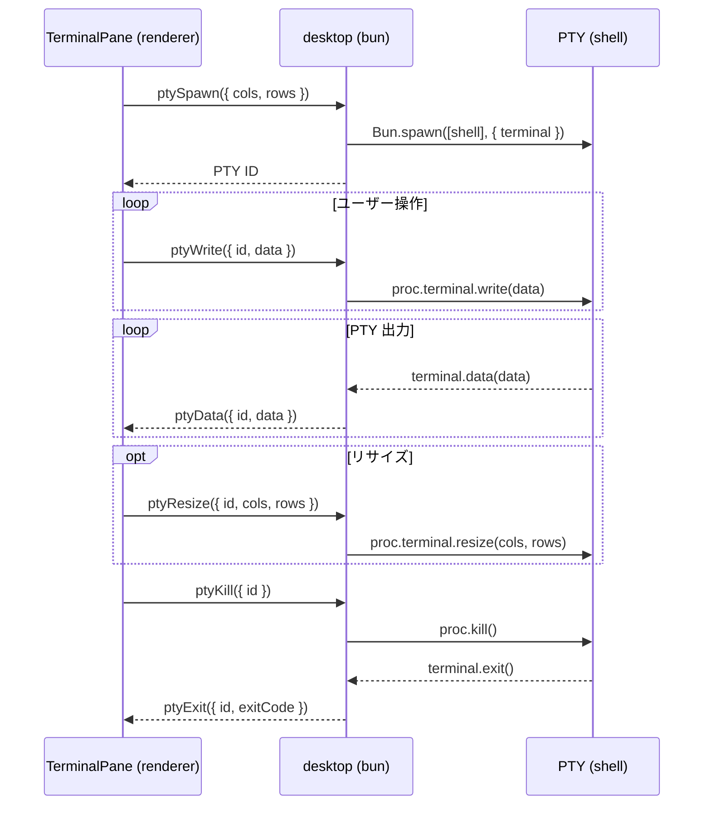

# Terminal

ターミナルエミュレータ。Electrobun RPC 経由で desktop 側の PTY プロセスと通信する。
バックエンドとして xterm.js（デフォルト）と ghostty-web を UI から切り替えられる。

## 構成

```
features/terminal/
├── TerminalPane.vue       # バックエンド切り替えラッパー
├── XtermTerminal.vue      # xterm.js バックエンド（デフォルト）
├── GhosttyTerminal.vue    # ghostty-web バックエンド
└── terminalConfig.ts      # 共通設定（フォント、テーマ）
```

## PTY ライフサイクル



- shell: `process.env.SHELL` または `zsh`
- cwd: ウィンドウのワークスペースディレクトリ

## バックエンド

| バックエンド | ライブラリ                      | リサイズ方式             | 備考                    |
| ------------ | ------------------------------- | ------------------------ | ----------------------- |
| xterm        | @xterm/xterm + @xterm/addon-fit | 手動 ResizeObserver      | 日本語入力が安定        |
| ghostty      | ghostty-web                     | FitAddon.observeResize() | WASM パーサーで高速描画 |

バックエンド切り替え時は PTY を再生成して新しいターミナルを開く。

## 共通設定（terminalConfig.ts）

- フォント: JetBrains Mono, Fira Code, Menlo, monospace（13px）
- テーマ: zinc 系ダークテーマ（背景 `#18181b`）
- カーソル: 点滅有効
- ANSI カラーは各バックエンドのデフォルトパレットを使用

## Desktop 側の PTY 管理

- `Map<number, PtyEntry>` で PTY ID → プロセスを管理
- ウィンドウ close 時に、そのウィンドウが所有する全 PTY を kill
- `Bun.spawn({ terminal })` で PTY をネイティブサポート（node-pty 不要）
